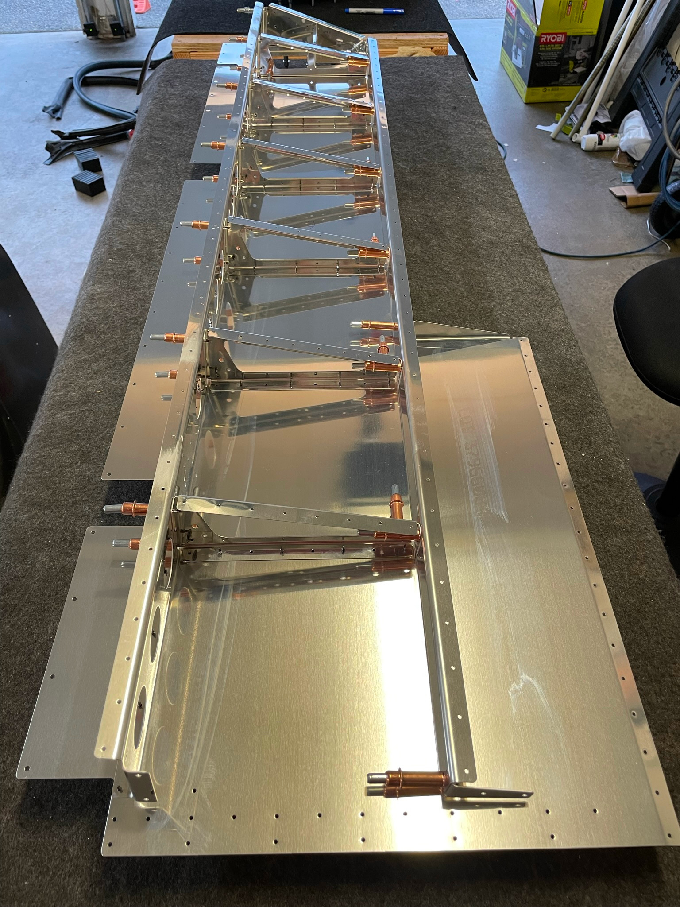
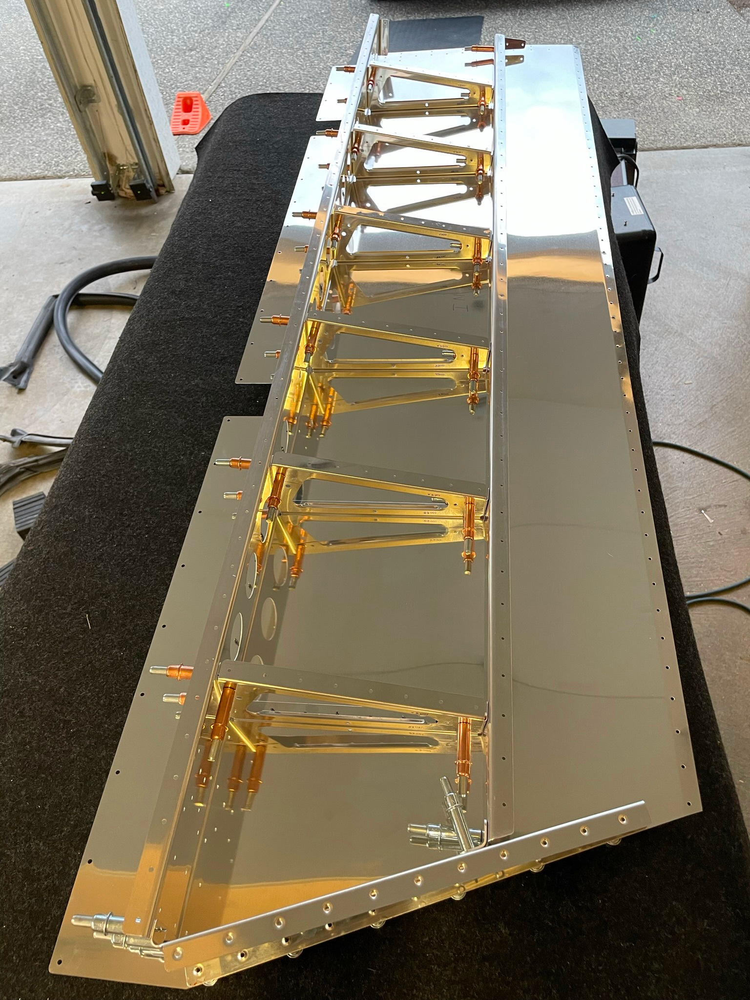

## Saturday July 16th, 2022

Hours: 9 
Pages: 09-03 - 09-06

### Summary
Created trim and trailing edge ribs, bent skin flanges, trimmed rear spar, prepped piano hinge for the trim tab, clecoed ribs and spars to the elevator skins.
 