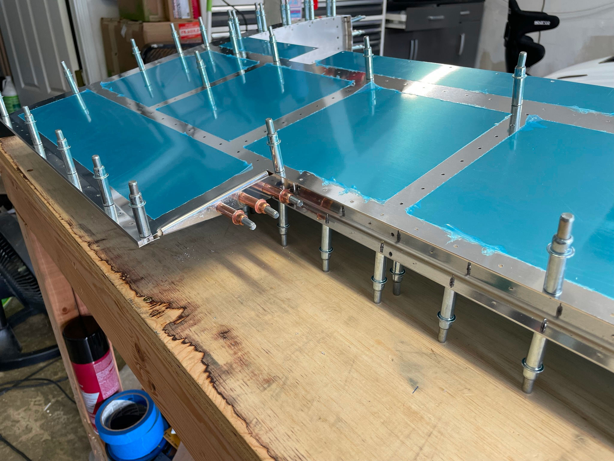
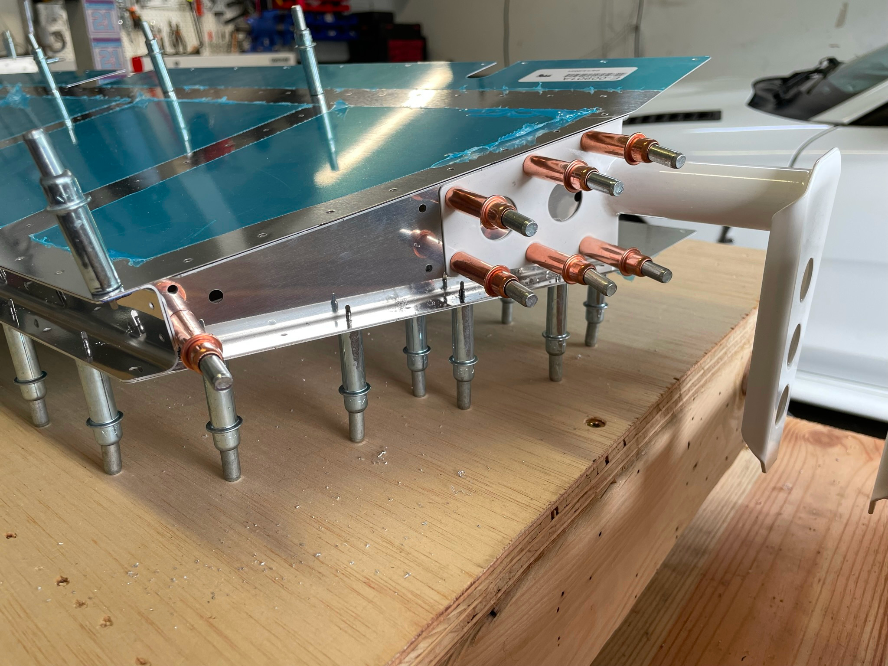
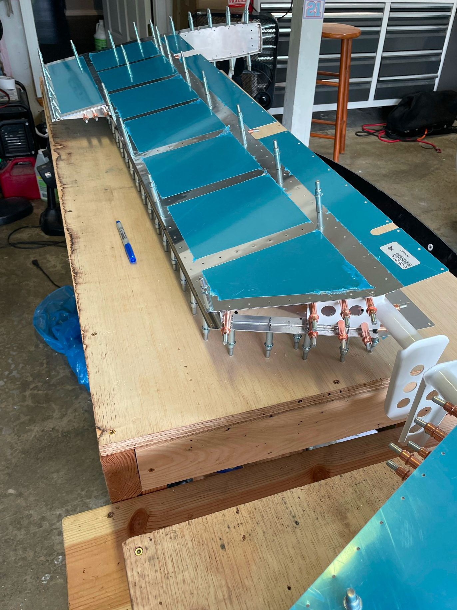

## Sunday July 17th, 2022

Hours: 8 
Pages: 09-06 - 09-09, Step 3

### Summary
Installed the tip ribs on both sides. Trimmed and modified the trailing edges as required. Closed in the left elevator skins, final drilled the elevator horns.

  
  
  
